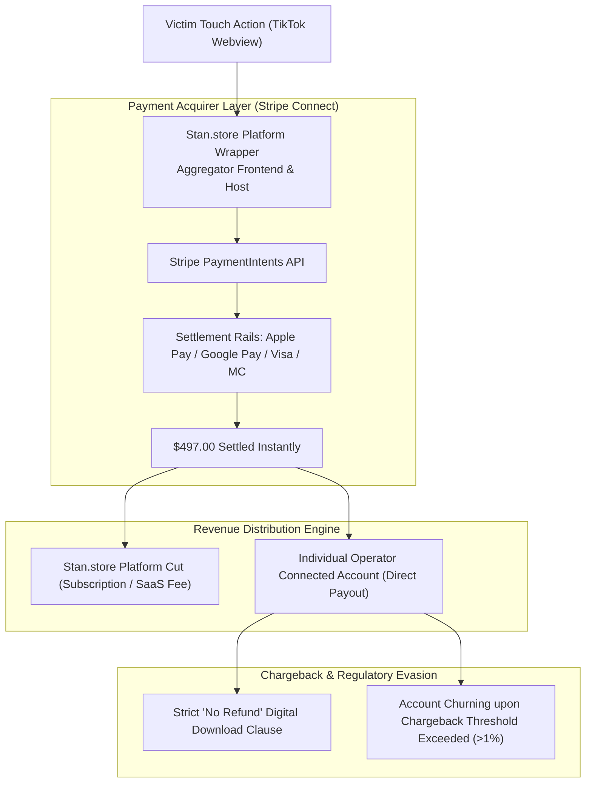

# Payment Gateway Abuse, Terms of Service Violations & Chargeback Mitigation

**Case File Reference:** `SEC-2025-MRR-001`  
**Classification:** `TLP:CLEAR`  
**Investigated Processors:** Stripe Connect, PayPal Merchant Services, Apple Pay In-App Rails  
**Primary Analyst:** `@stefanutc1`  
**Compliance Focus:** Payment Processor Acceptable Use Policies (AUP), Multi-Level Marketing (MLM) Prohibitions, Chargeback Circumvention

---

## 1. Executive Summary & Architectural Flow

To monetize automated social media funnels without establishing formal corporate merchant entities, Master Resell Rights (MRR) operators exploit modern SaaS storefront aggregators like **Stan.store**.

Stan.store provides a unified front that abstracts payment gateway integration via **Stripe Connect** and **PayPal Express Checkout**. By operating as connected accounts beneath an aggregator umbrella, individual operators evade the stringent onboarding underwriting, merchant risk assessment, and identity verification typically imposed on high-risk digital goods merchants.



---

## 2. Direct Violations of Payment Processor Acceptable Use Policies (AUP)

Both major global payment processors explicitly prohibit operations matching the structural mechanics of Master Resell Rights:

### 2.1. Stripe Prohibited and Restricted Businesses Policy
Under Stripe's global compliance standards, the following categories are strictly barred from utilizing Stripe processing services:
- **"Multi-Level Marketing (MLM)"**: Businesses that reward participants primarily for reselling the system itself or recruiting downstream resellers.
- **"Get-Rich-Quick Schemes"**: Operations that promise rapid, high-margin passive income with minimal capital or effort, utilizing deceptive testimonials.
- **"Unfair, Predatory, or Deceptive Practices"**: Products sold under artificial urgency without clear disclosure of real earnings distributions.

### 2.2. PayPal Acceptable Use Policy (Section 2)
PayPal prohibits the use of its payment rails for:
- *"Pyramid, matrix, multi-level marketing, or other 'get rich quick' schemes, or certain network marketing programs."*

> [!WARNING]
> By classifying \$497 MRR transactions as generic "Digital Products" or "Consulting E-Books", operators deliberately misclassify merchant category codes (MCC 5818 / 5968) to bypass automated fraud filters.

---

## 3. Threat Actor Chargeback Evasion Tactics

Because financial pyramid and resale schemes experience elevated rates of buyer regret and consumer disputes, operators deploy deliberate contractual and technical barriers to suppress chargebacks:

### 3.1. Weaponizing the "Immediate Digital Access" Waiver
During checkout, the customer is forced to tick a mandatory checkbox:
```text
[X] "I agree that by accessing this digital download immediately, 
I expressly waive my statutory 14-day right of withdrawal under EU Consumer Protection laws. 
All sales are final, non-refundable, and irrevocable."
```
- **Legal Reality:** Under EU Directive 2011/83/EU on Consumer Rights, the waiver of the right of withdrawal is only valid for *genuine* digital content. When the underlying transaction involves deceptive marketing or an illegal pyramid-style promotion (Directive 2005/29/EC Annex I), the contract is void *ab initio*, and the consumer retains full statutory dispute and chargeback rights.

### 3.2. Merchant Account Churning
When an operator's Stripe dispute rate approaches the critical **1.0% threshold** (the standard ceiling before Visa/Mastercard monitoring programs trigger heavy fines or merchant termination):
- The operator abandons the connected account.
- The operator re-registers on Stan.store using a different email address and routing numbers from secondary digital banking providers (Wise, Revolut Business).
- The TikTok bio link is redirected to the new endpoint within minutes.

---

## 4. Formal Escalation & Actionable Remedies

1. **Stripe Integrity Reporting:** Formal abuse reports were filed with `abuse@stan.store`, `compliance@stan.store`, and `legal@stripe.com`, providing transaction hashes and evidentiary course extraction dumps.
2. **Banking Chargeback Path (Reason Code 53 / Condition 13.1):** Consumers who fall victim to MRR schemes can initiate chargebacks through their card-issuing bank citing **"Services/Merchandise Not as Described"** or **"Deceptive Practices / Misrepresentation"**, presenting the synthetic LLM course contents as evidence that the advertised business curriculum was fraudulent.
