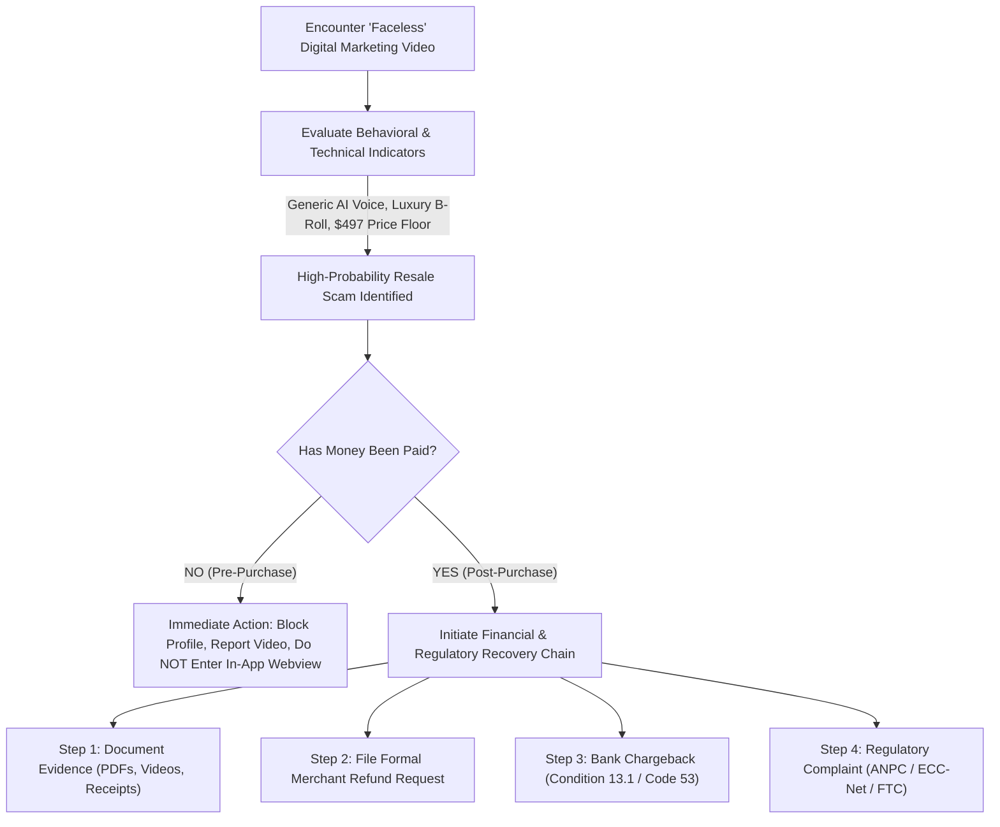

# Consumer Protection Advisory: Detecting & Mitigating Social Media Resale Scams

**Case File Reference:** `SEC-2025-MRR-001`  
**Classification:** `TLP:CLEAR`  
**Target Audience:** Consumers, Digital Banking Users, Secondary School & University Students  
**Regulatory Frameworks:** Romanian National Consumer Protection Authority (ANPC), European Consumer Centre (ECC-Net), EU Unfair Commercial Practices Directive (2005/29/EC)

---

## 1. Executive Summary & Advisory Scope

Digital marketing schemes operating on short-form video platforms (TikTok, Instagram Reels, YouTube Shorts) frequently disguise recursive pyramid business models as legitimate online education.

This guide provides technical heuristics, behavioral indicators, and step-by-step dispute resolution workflows for identifying deceptive "Master Resell Rights" (MRR) funnels and reclaiming misappropriated funds through standard financial and regulatory mechanisms.



---

## 2. Technical & Behavioral Red Flag Matrix

Before entering credit card details or digital wallet authorizations on an in-app landing page, audit the offering against the following verified threat signatures:

| Dimension | Warning Indicator | Technical Reality |
| :--- | :--- | :--- |
| **Video Production** | Faceless B-roll + synthetic robotic or cloned AI voiceover. | Automated batch generation via ElevenLabs and CapCut to mask operator identity. |
| **Financial Claims** | Promises of \$3,000–\$10,000/month within weeks using *"just your phone"*. | Mathematical impossibility; profits depend entirely on downstream participant recruitment. |
| **Product Utility** | The course primarily teaches you how to resell the *same course*. | Recursive pyramid structure; zero external market demand for the underlying content. |
| **Price Point** | Exactly \$497.00 (or equivalent in EUR / RON) crossed out from \$1,997. | Universal standardized price floor mandated by the upstream syndicate license. |
| **Hosting Platform**| Standalone single-page storefronts on `stan.store`, `beacons.ai`, `gumroad`. | Circumvention of traditional merchant underwriting and business verification. |
| **Terms of Service**| Aggressive *"No Refunds / Digital Waiver"* disclaimer immediately above submit. | Deceptive contract clause designed to suppress chargeback claims upon buyer remorse. |

---

## 3. Account Age & Infrastructure Verification Checklist

If evaluating a suspicious social media entrepreneur, run the following verification steps:

1. **Profile Creation Date:** Check account registration age. Many high-velocity MRR accounts are less than 90 days old with high post counts uploaded in rapid succession.
2. **Domain Registration History:** Using WHOIS lookup utilities, inspect when the custom domain was provisioned. Most threat operators utilize domains registered within the last 1–6 months.
3. **Comment Section Sanitization:** Inspect post comments. If all comments consist exclusively of generic emojis (🔥, 👏) or keywords prompted by the creator (*"Comment 'FREEDOM' to get the link"*), the operator is using automated bot engagement to game algorithmic discovery.

---

## 4. Post-Purchase Incident Response & Dispute Playbook

If you or an associate have purchased a \$497 MRR bundle and discovered it to be a synthetic LLM-generated document:

### Step 1: Secure Digital Evidence
- Save the complete PDF files, license agreements, transaction confirmation emails, and Stripe/PayPal receipts.
- Record screen captures of the originating TikTok profile and the specific video that advertised the product.
- Compute SHA-256 hashes of the files to establish a cryptographic chain of custody.

### Step 2: Demand Formal Merchant Refund
- Send a formal email to the merchant handle and `support@stan.store`:
  ```text
  Subject: Formal Demand for Refund – Deceptive Transaction & Unfair Commercial Practice
  
  I am writing to formally demand an immediate full refund of $497.00 for order [ORDER_ID]. 
  The purchased materials violate EU Directive 2005/29/EC (Unfair Commercial Practices) 
  and constitute an unlawful pyramid scheme under Annex I, Item 14. The delivered text 
  is synthetic AI-generated content lacking the advertised commercial utility. 
  If this refund is not executed within 48 hours, a formal banking chargeback and regulatory 
  complaints to ANPC and the FTC will be filed immediately.
  ```

### Step 3: Initiate Card Issuer Chargeback
- Contact your issuing bank (e.g., BCR, Banca Transilvania, ING, Revolut).
- Request a formal chargeback under **Visa Condition 13.1** or **Mastercard Reason Code 4853**: *"Merchandise/Services Not as Described or Defective"*.
- Provide the merchant email transcript, evidence that the course consists of recycled generic ChatGPT summaries, and the MRR license requiring you to resell the bundle to monetize it.

### Step 4: File Consumer Protection Reports
- **Romania:** File an online complaint with the **Autoritatea Națională pentru Protecția Consumatorilor (ANPC)** at `anpc.ro`.
- **European Union:** If the seller is based in another EU member state, submit an investigation request via the **European Consumer Centre Network (ECC-Net)**.
- **United States:** Submit an incident filing with the **Federal Trade Commission (FTC)** at `reportfraud.ftc.gov`.
