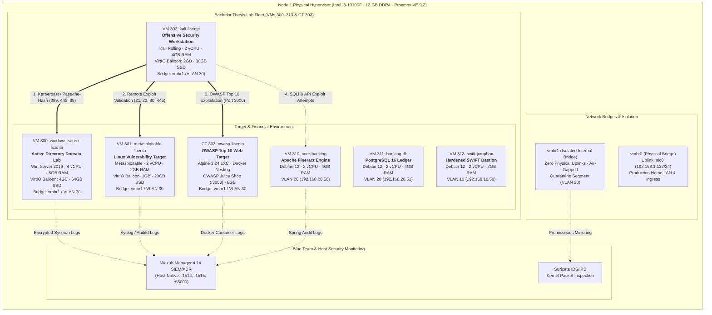

# Bachelor's Thesis CyberLab Architecture Specification

<div align="center">

[-0f172a.svg?style=flat&logo=academia)](#)
[](https://github.com/stefanutc1)
[](https://feaa.ucv.ro)
[-10b981.svg?style=flat)](#)
[](https://github.com/stefanutc1/university)
[](#)

</div>

---

## 1. Executive Summary & Research Objectives

This document specifies the architecture, network segmentation, virtualization parameters, and security policies governing the dedicated **Bachelor's Thesis (Lucrare de Licență)** research infrastructure deployed on the primary Proxmox VE 9.2 hypervisor host (`192.168.1.132`, Node 1).

- **Academic Candidate**: **Moană Ștefănuț-Cornel** ([`@stefanutc1`](https://github.com/stefanutc1))
- **Institution**: **Universitatea din Craiova** · **Facultatea de Economie și Administrarea Afacerilor (FEAA)**
- **Degree Program**: **Informatică Economică (2024 – 2027)**
- **Curriculum Repository**: [`https://github.com/stefanutc1/university`](https://github.com/stefanutc1/university)
- **Thesis Courses**: `LL3 - LucrareLicenta` & `PELL3 - PracticaElaborareLucrareLicenta`

The laboratory environment delivers an isolated, reproducible proving ground for:
1. **Core-Banking Architecture & Resiliency**: Practical implementation of Apache Fineract (Java 17, Spring Boot), PostgreSQL 16 ACID financial ledgers with `pgAudit`, and an isolated SWIFT customer-bastion jumpbox simulating real-world financial transaction pipelines.
2. **Offensive Security & Red Team Automation**: Automated scanning, enumeration, exploitation, and post-exploitation workflows executed from a dedicated Kali Linux workstation.
3. **Enterprise Active Directory Security**: Auditing domain controller hygiene, Group Policy Objects (GPOs), Kerberoasting, AS-REP roasting, and pass-the-hash attacks on Windows Server.
4. **Multi-Vector Vulnerability Assessment**: Targeting known CVEs, legacy services, and unpatched daemons on Linux Metasploitable targets.
5. **Modern Web Application Security (OWASP Top 10)**: Assessing contemporary web flaws (SQL injection, broken access control, XSS, insecure deserialization) in a containerized OWASP Juice Shop target running on Alpine Linux LXC.
6. **Blue Team Telemetry & Detection Engineering**: Calibrating Wazuh SIEM 4.14 agent detection rules, Suricata IDS/IPS signatures, and Windows Sysmon Event IDs (EID 1, 3, 7, 8, 10, 13).

---

## 2. End-to-End Architectural Topology

The thesis laboratory utilizes a dual-tier isolation model. Workloads operate on **VLAN 30 (CyberLab Quarantine)** and **VLAN 20 (Core Banking)** attached to the isolated Linux bridge **`vmbr1`**, completely decoupled from the production home local area network (`vmbr0` / `192.168.1.0/24`).


```mermaid
flowchart TB
    subgraph HYPERVISOR["Node 1 Physical Hypervisor (Intel i3-10100F · 12 GB DDR4 · Proxmox VE 9.2)"]
        direction TB

        subgraph BRIDGES["Network Bridges & Isolation"]
            VMBR0["vmbr0 (Physical Bridge)<br/>Uplink: nic0 (192.168.1.132/24)<br/>Production Home LAN & Ingress"]
            VMBR1["vmbr1 (Isolated Internal Bridge)<br/>Zero Physical Uplinks · Air-Gapped<br/>Quarantine Segment (VLAN 30)"]
        end

        subgraph THESIS_FLEET["Bachelor Thesis Lab Fleet (VMs 300–313 & CT 303)"]
            direction LR
            VM302["VM 302: kali-licenta<br/><b>Offensive Security Workstation</b><br/>Kali Rolling · 2 vCPU · 4GB RAM<br/>VirtIO Balloon: 2GB · 30GB SSD<br/>Bridge: vmbr1 (VLAN 30)"]
            
            subgraph TARGETS["Target & Financial Environment"]
                VM310["VM 310: core-banking<br/><b>Apache Fineract Engine</b><br/>Debian 12 · 2 vCPU · 4GB RAM<br/>VLAN 20 (192.168.20.50)"]
                VM311["VM 311: banking-db<br/><b>PostgreSQL 16 Ledger</b><br/>Debian 12 · 2 vCPU · 4GB RAM<br/>VLAN 20 (192.168.20.51)"]
                VM313["VM 313: swift-jumpbox<br/><b>Hardened SWIFT Bastion</b><br/>Debian 12 · 2 vCPU · 2GB RAM<br/>VLAN 10 (192.168.10.50)"]
                VM300["VM 300: windows-server-licenta<br/><b>Active Directory Domain Lab</b><br/>Win Server 2019 · 4 vCPU · 8GB RAM<br/>VirtIO Balloon: 4GB · 64GB SSD<br/>Bridge: vmbr1 / VLAN 30"]
                VM301["VM 301: metasploitable-licenta<br/><b>Linux Vulnerability Target</b><br/>Metasploitable · 2 vCPU · 2GB RAM<br/>VirtIO Balloon: 1GB · 20GB SSD<br/>Bridge: vmbr1 / VLAN 30"]
                CT303["CT 303: owasp-licenta<br/><b>OWASP Top 10 Web Target</b><br/>Alpine 3.24 LXC · Docker Nesting<br/>OWASP Juice Shop (:3000) · 8GB<br/>Bridge: vmbr1 / VLAN 30"]
            end
        end

        subgraph TELEMETRY["Blue Team & Host Security Monitoring"]
            WAZUH["Wazuh Manager 4.14 SIEM/XDR<br/>(Host Native: :1514, :1515, :55000)"]
            SURICATA["Suricata IDS/IPS<br/>Kernel Packet Inspection"]
        end
    end

    %% Attack Flows
    VM302 ==>|"1. Kerberoast / Pass-the-Hash (389, 445, 88)"| VM300
    VM302 ==>|"2. Remote Exploit Validation (21, 22, 80, 445)"| VM301
    VM302 ==>|"3. OWASP Top 10 Exploitation (Port 3000)"| CT303
    VM302 -.->|"4. SQLi & API Exploit Attempts"| VM310

    %% Telemetry Flows
    VM300 -.->|"Encrypted Sysmon Logs"| WAZUH
    VM301 -.->|"Syslog / Auditd Logs"| WAZUH
    CT303 -.->|"Docker Container Logs"| WAZUH
    VM310 -.->|"Spring Audit Logs"| WAZUH
    VMBR1 -.->|"Promiscuous Mirroring"| SURICATA
```

---

## 3. Workload Profiles & Technical Specifications

### 3.1 VM 310: `core-banking` (Apache Fineract Engine)
- **Role**: Core financial processing engine.
- **Technology Stack**: Apache Fineract, OpenJDK 17, Spring Boot, Liquibase.
- **Resources**: 2 vCPU, 4,096 MB RAM (VirtIO balloon: 2,048 MB), 40 GB NVMe disk.
- **Network**: VLAN 20 (`192.168.20.50`), static IP.
- **Operational Mode**: On-demand execution (`onboot: 0`).

### 3.2 VM 311: `banking-db` (PostgreSQL Financial Ledger)
- **Role**: High-integrity double-entry transaction database.
- **Technology Stack**: PostgreSQL 16, pgAudit extension, SCRAM-SHA-256 encryption.
- **Resources**: 2 vCPU, 4,096 MB RAM (VirtIO balloon: 2,048 MB), 50 GB NVMe disk.
- **Network**: VLAN 20 (`192.168.20.51`), static IP.
- **Operational Mode**: On-demand execution (`onboot: 0`).

### 3.3 VM 313: `swift-jumpbox` (Hardened SWIFT Bastion)
- **Role**: Privileged administrative access gateway adhering to SWIFT Customer Security Programme (CSP).
- **Technology Stack**: Hardened Debian 12, MFA verification, OpenSSH with certificate validation.
- **Resources**: 2 vCPU, 2,048 MB RAM (VirtIO balloon: 1,024 MB), 25 GB NVMe disk.
- **Network**: VLAN 10 (`192.168.10.50`), static IP.
- **Operational Mode**: On-demand execution (`onboot: 0`).

### 3.4 VM 300: `windows-server-licenta` (Active Directory DS Lab)
- **Role**: Enterprise identity and domain controller target.
- **Technology Stack**: Windows Server 2019 Standard, Sysmon, AD DS.
- **Resources**: 4 vCPU, 8,192 MB RAM (VirtIO balloon: 4,096 MB), 64 GB NVMe disk.
- **Network**: VLAN 30 (`192.168.30.100`), static IP.
- **Operational Mode**: On-demand execution (`onboot: 0`).

### 3.5 VM 301: `metasploitable-licenta` (Linux Target)
- **Role**: Vulnerable Linux service target for exploit testing.
- **Resources**: 2 vCPU, 2,048 MB RAM (VirtIO balloon: 1,024 MB), 20 GB NVMe disk.
- **Network**: VLAN 30 (`192.168.30.101`), static IP.
- **Operational Mode**: On-demand execution (`onboot: 0`).

### 3.6 VM 302: `kali-licenta` (Red Team Operator Workstation)
- **Role**: Offensive security scanner and exploit platform.
- **Technology Stack**: Kali Linux Rolling, Metasploit Framework, Burp Suite, Impacket, BloodHound.
- **Resources**: 2 vCPU, 4,096 MB RAM (VirtIO balloon: 2,048 MB), 30 GB NVMe disk.
- **Network**: VLAN 30 (`192.168.30.102`), static IP.
- **Operational Mode**: On-demand execution (`onboot: 0`).

### 3.7 CT 303: `owasp-licenta` (OWASP Juice Shop / DVWA Container)
- **Role**: Containerized modern web application vulnerability target.
- **Technology Stack**: Alpine Linux 3.24 LXC, nested Docker, OWASP Juice Shop (`:3000`).
- **Resources**: 2 vCPU, 512 MB RAM, 8 GB NVMe rootfs.
- **Network**: VLAN 30 (`192.168.30.103`), static IP.
- **Operational Mode**: On-demand execution (`onboot: 0`).

---

## 4. Network Isolation & Security Architecture

### 4.1 Linux Bridge Segregation (`vmbr0` vs `vmbr1`)
- **`vmbr0` (Production Bridge)**: Attached to physical NIC `enp3s0`. Serves home LAN traffic (`192.168.1.0/24`) and hypervisor management.
- **`vmbr1` (Quarantined CyberLab Bridge)**: Virtual software bridge with zero physical network interfaces assigned. Guarantees **hardware-level air-gapping** from local physical devices. Exploits, ARP poisoning, and reverse shells executed on `vmbr1` **cannot leak** to external hardware or home subnets.

### 4.2 Inter-VLAN Firewall Policy Matrix

```text
┌───────────────────┬────────────────────┬────────────────────────┬──────────┬───────────────────┐
│ Source Subnet     │ Destination Subnet │ Ports / Protocols      │ Action   │ Security Purpose  │
├───────────────────┼────────────────────┼────────────────────────┼──────────┼───────────────────┤
│ VLAN 30 (CyberLab)│ VLAN 10 (Mgmt)     │ ANY                    │ DROP     │ Full Quarantine   │
│ VLAN 30 (CyberLab)│ VLAN 20 (Core)     │ ANY                    │ DROP     │ Full Quarantine   │
│ VLAN 30 (CyberLab)│ WAN (Internet)     │ ANY                    │ DROP     │ Zero Exploit Leak │
│ VLAN 10 (Mgmt)    │ VLAN 30 (CyberLab) │ SSH (22), RDP (3389)   │ PASS     │ Admin Management  │
│ VM 302 (Kali)     │ VM 300, 301, CT303 │ ANY (VLAN 30 Internal) │ PASS     │ Lab Exploitation  │
└───────────────────┴────────────────────┴────────────────────────┴──────────┴───────────────────┘
```

---

## 5. Declarative Infrastructure as Code References

All Bachelor Thesis infrastructure components are codified cleanly in the repository:
- **Terraform Hypervisor Provisioning**: [`terraform/licenta.tf`](../terraform/licenta.tf)
- **Ansible Fleet Inventory**: [`ansible/inventories/homelab/hosts.yml`](../ansible/inventories/homelab/hosts.yml)
- **Proxmox VM Configuration Templates**:
  - `services/x64/windows-server-licenta/300.conf`
  - `services/x64/metasploitable-licenta/301.conf`
  - `services/x64/kali-licenta/302.conf`
  - `services/x64/owasp-licenta/303.conf`
- **Docker Target Compose**: `services/x64/owasp-licenta/docker-compose.yml`
- **Lab Startup & Teardown Automation**:
  - Start drill: `bash scripts/licenta-lab-start.sh`
  - Stop drill: `bash scripts/licenta-lab-stop.sh`

---

<div align="center">

*Bachelor's Thesis Research Laboratory · **Moană Ștefănuț-Cornel** (`@stefanutc1`).*  
*Universitatea din Craiova · Facultatea de Economie și Administrarea Afacerilor (FEAA) · Informatică Economică (2024–2027).*

</div>
