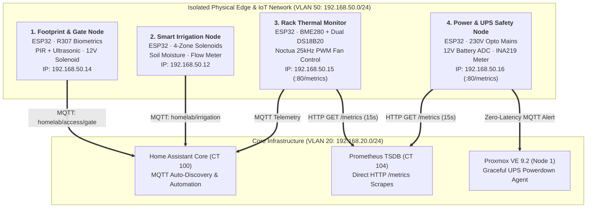

# ESP32 Edge Systems & Physical Telemetry Suite

**Platform Architect**: Moană Ștefănuț-Cornel ([@stefanutc1](https://github.com/stefanutc1))  
**Academic Affiliation**: Universitatea din Craiova · FEAA — Informatică Economică (2024 – 2027)  
**Engineering Experience**: Hands-on Software & Systems Engineering since 2015  
**Network Segment**: VLAN 50 (`192.168.50.0/24` — Isolated IoT & Hardware Edge)  
**Central Telemetry Broker**: Mosquitto / Home Assistant (`192.168.20.10:1883`)

---

## 1. Overview & Edge Architecture

The `esp32/` directory houses the complete bare-metal firmware suite powering edge sensing, environmental control, biometric physical security, and datacenter hardware safety. Each project is engineered as an autonomous, fail-safe edge node:



---

## 2. Project Directory Structure

```text
esp32/
├── README.md                           # Master suite documentation
├── hardware_telemetry_daemon.py        # Python host-side serial/MQTT ingestion bridge
├── firmware/
│   └── i2c_bus_recovery.c              # Bare-metal I2C 9-clock register recovery driver
├── footprint/                          # Biometric physical gate & room presence controller
│   ├── footprint.ino                   # Production Arduino C++ sketch
│   ├── config.h                        # GPIO pinouts, MQTT topics & thresholds
│   ├── sensor.cpp / sensor.h           # Biometric optical fingerprint sensor drivers
│   ├── gate.cpp / gate.h               # 12V solenoid relay control with safety watchdog
│   └── README.md                       # Electrical wiring & Home Assistant configuration
├── irrigation/                         # Smart weather-aware 4-zone irrigation controller
│   ├── irrigation.ino                  # Production Arduino C++ sketch
│   ├── config.h                        # Relay pins, ADC moisture calibration & safety limits
│   ├── valve.cpp / control.cpp         # Valve actuation & fail-safe automatic shutoff
│   ├── ore.cpp / vreme.cpp             # RTC scheduler & soil moisture logic
│   ├── config.yaml / sector_1.yaml     # Declarative zone mapping specifications
│   └── README.md                       # Plumbing safety, flow meter wiring & topics
├── datacenter_environment/             # Server rack thermal & environmental controller
│   ├── datacenter_environment.ino      # Production Arduino C++ sketch
│   ├── config.h                        # BME280, DS18B20 1-Wire & 25kHz PWM fan pinouts
│   └── README.md                       # Prometheus scrape config & Noctua fan curve
└── power_monitor/                      # Datacenter mains AC & UPS battery safety monitor
    ├── power_monitor.ino               # Production Arduino C++ sketch
    ├── config.h                        # Optocoupler interrupt, INA219 I2C & battery divider
    └── README.md                       # High-voltage safety guidelines & emergency shutdown
```

---

## 3. Engineering Safety Standards Across All Firmware

1. **Hardware Watchdog Timers (`esp_task_wdt`)**: Every sketch initializes the hardware watchdog timer (`12–15 seconds`). If an event loop freezes or an I2C transaction stalls, the microcontroller automatically reboots into a known safe state.
2. **Fail-Safe Solenoid Relay States**:
   - Gate solenoid relay defaults to **LOCKED** (`LOW`).
   - Irrigation valves default to **CLOSED** (`HIGH` on Active-LOW optocoupled relay boards).
   - Maximum watering duration is hard-coded to **15 minutes** in software, preventing flooding even if network connection drops while a valve is open.
3. **Network Isolation**: All ESP32 devices reside strictly in **VLAN 50 (IoT & Physical Edge)**. Inter-VLAN routing is governed by OPNsense stateful packet filtering (`pf`), blocking direct access to Management (VLAN 10) or WAN.
4. **Native Prometheus Support**: Environment and Power nodes serve standard OpenMetrics format directly on HTTP port 80, eliminating the need for third-party serial polling bridges.
