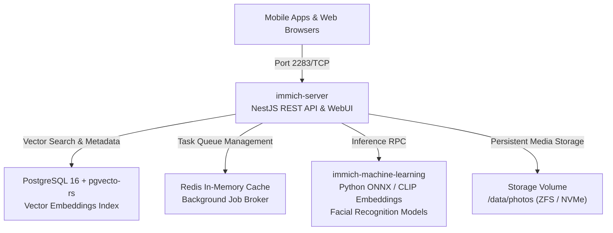

# Immich Self-Hosted Photo & Video Management Suite

<div align="center">

[](#)
[](#)
[](#)
[](#)
[](#)

</div>

---

## Executive Summary

This module deploys the self-hosted photo, video backup, indexing, and computer-vision classification platform for the homelab. It serves as a privacy-preserving, high-performance replacement for commercial cloud photo services.

---

## 1. Microservice Architecture



- **`immich-server`**: Central API gateway and application coordinator on port `2283/TCP`. Handles user authentication, metadata extraction, FFmpeg video transcoding, and client synchronization.
- **`immich-machine-learning`**: Dedicated neural processing container. Executes CLIP models for semantic natural-language photo search and facial detection/clustering algorithms.
- **`database`**: Dedicated PostgreSQL instance extended with `pgvecto-rs` for high-dimensional vector similarity indexing of CLIP embeddings.
- **`redis`**: Distributed asynchronous queue broker orchestrating thumbnail generation, EXIF parsing, and video transcodes.

---

## 2. Storage Mapping & Hardware Acceleration

| Volume Path | Host Mount Point | Purpose |
| :--- | :--- | :--- |
| `/usr/src/app/upload` | `/data/photos` | Master immutable original photo and video vault |
| `/var/lib/postgresql/data` | `local-lvm:vm-immich-db` | Relational metadata, album states, and vector embeddings |
| `/dev/dri` | Host Intel QuickSync / VAAPI | Hardware-accelerated H.264/HEVC video transcoding |

---

## 3. Deployment & Operational Runbook

```bash
# 1. Prepare environment variables
cp .env.example .env

# 2. Configure database credentials and storage root paths in .env
# DB_PASSWORD=<generated_secure_secret>
# UPLOAD_LOCATION=/data/photos

# 3. Launch stack
docker compose up -d

# 4. Verify service health
docker compose ps
curl -s http://127.0.0.1:2283/api/server-info/ping
```

The WebUI becomes accessible internally via `http://<HOST_IP>:2283` or via Caddy reverse proxy at `https://photos.lan` with automated mTLS.
