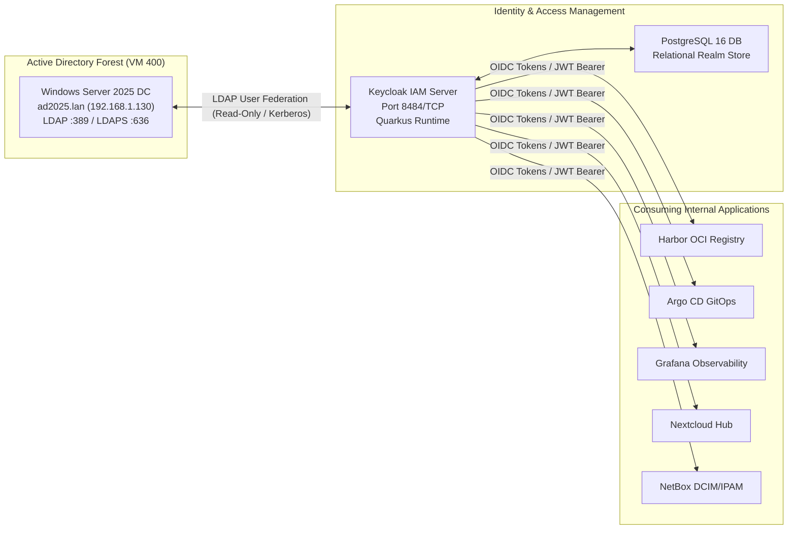

# Keycloak Enterprise Identity & Access Management (IAM)

<div align="center">

[](#)
[](#)
[](#)
[](#)

</div>

---

## Executive Summary

Keycloak provides enterprise identity federation, Single Sign-On (SSO), and role-based access control (RBAC) across the homelab infrastructure. It bridges legacy directory services in **Active Directory Domain Services (AD DS)** with modern web applications through **OpenID Connect (OIDC)**, **OAuth 2.0**, and **SAML 2.0** profiles.

---

## 1. Architectural Topology & Federation Pipeline



---

## 2. Active Directory Domain Services (AD DS) Integration

To federate users and security groups from the Windows Server Domain Controller:

1. Access the Keycloak administration console at `http://<HOST_IP>:8484`.
2. Navigate to **User Federation** -> **Add LDAP provider**.
3. Configure the following connection parameters:
   - **Console Vendor**: Active Directory
   - **Connection URL**: `ldap://192.168.1.130:389` (or `ldaps://192.168.1.130:636`)
   - **Users DN**: `CN=Users,DC=infrastructure,DC=lan`
   - **Bind DN**: `CN=Administrator,CN=Users,DC=infrastructure,DC=lan`
   - **Edit Mode**: `READ_ONLY` (or `UNSYNCED` for test writebacks)
   - **Periodic Changed Users Sync**: Enabled (interval: 300s)

All domain users and security groups automatically populate Keycloak realms, enabling unified credentials and multi-factor authentication (TOTP/WebAuthn) for downstream services.

---

## 3. Deployment Runbook

```bash
# 1. Prepare environment variables
cp .env.example .env

# 2. Configure administrative credentials and database secrets
# KEYCLOAK_ADMIN=<admin_username>
# KEYCLOAK_ADMIN_PASSWORD=<secure_password>

# 3. Start container stack
docker compose up -d

# 4. Verify endpoint health
curl -s http://127.0.0.1:8484/health/ready
```
