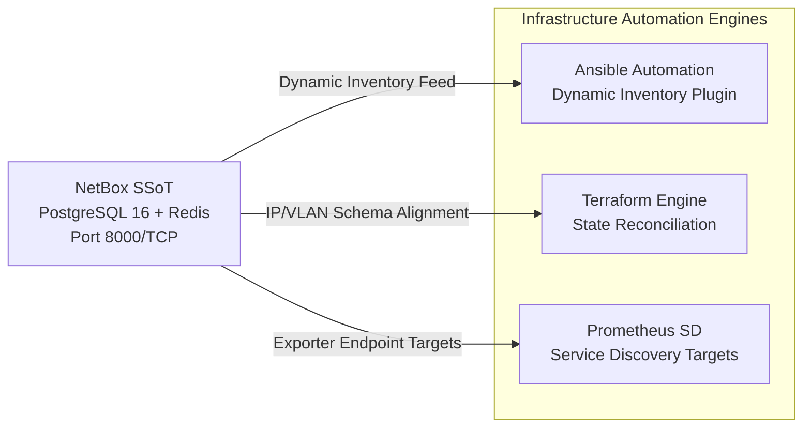

# NetBox — Source of Truth for DCIM & IPAM

<div align="center">

[](#)
[](#)
[](#)
[](#)

</div>

---

## Executive Summary

NetBox functions as the centralized **Single Source of Truth (SSoT)** for the entire homelab and private cloud infrastructure:
- **IPAM (IP Address Management)**: Authoritative tracking of all 802.1Q VLANs, VRFs, subnets, and static/DHCP IP assignments.
- **DCIM (Data Center Infrastructure Management)**: Inventory of physical server chassis, hardware racks, Proxmox hypervisor nodes, KVM virtual machines, and LXC containers.
- **Infrastructure as Code Integration**: Dynamic inventory plugin integration with Ansible (`netbox.netbox.nb_inventory`) and resource state management via Terraform (`netbox-community/netbox`).

---

## 1. Architectural Topology & Synchronization



---

## 2. Deployment Runbook

```bash
# 1. Prepare configuration
cp .env.example .env

# 2. Configure administrative credentials and generate SECRET_KEY
# python3 -c 'import secrets; print(secrets.token_hex(50))'

# 3. Launch stack
docker compose up -d

# 4. Verify endpoint responsiveness
curl -s http://127.0.0.1:8000/api/status/ | jq .
```

The WebUI is accessible locally at `http://<HOST_IP>:8000` or through Caddy reverse proxy at `https://netbox.lan` with client mTLS enforcement.
