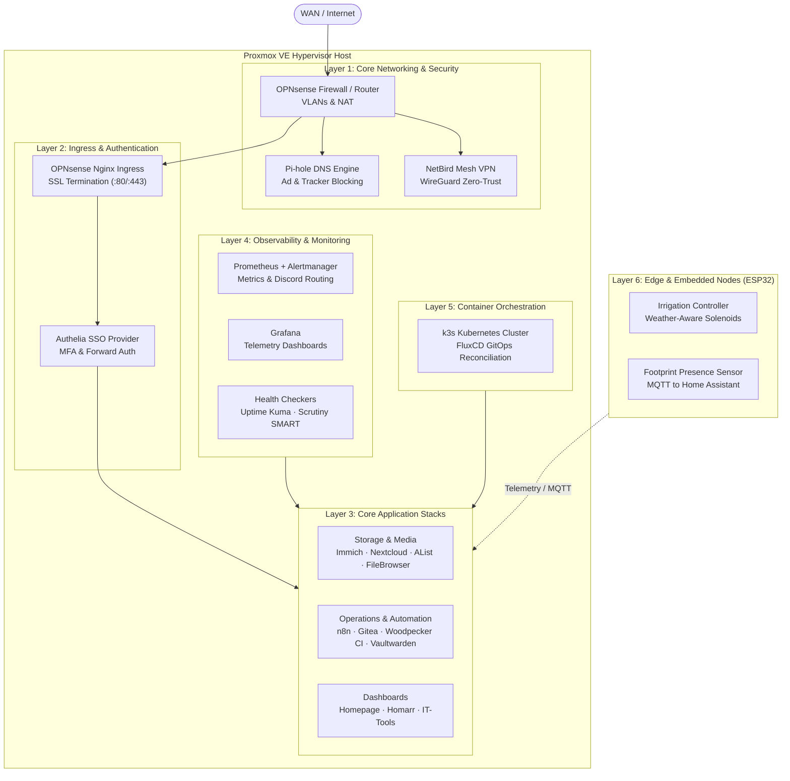

# Homelab Infrastructure Wiki

Welcome to the **Homelab Knowledge Base**. This wiki contains the complete architectural blueprints, configuration standards, operations runbooks, and disaster recovery procedures for the entire homelab environment.

---

## Table of Contents

1. **[[Architecture & Networking|Architecture-and-Networking]]** — VLAN topology, subnet allocations, firewall rules, and reverse proxy routing.
2. **[[Services Catalog|Services-Catalog]]** — Complete inventory of 30+ containerized services, exposed ports, and volume layouts.
3. **[[Infrastructure as Code|Infrastructure-as-Code]]** — Terraform Proxmox VM modules and multi-hypervisor IaC (Xen, ESXi, Hyper-V, bhyve).
4. **[[Kubernetes & GitOps|Kubernetes-and-GitOps]]** — k3s cluster configuration, Ansible bootstrap, and continuous FluxCD sync.
5. **[[Monitoring & Alerting|Monitoring-and-Alerting]]** — Prometheus metrics scraping, node-level alert triggers, and Discord webhook routing.
6. **[[ESP32 Edge Systems|ESP32-Edge-Systems]]** — Embedded C++ firmware for automated garden irrigation and physical occupancy tracking.
7. **[[Runbooks & Disaster Recovery|Runbooks-and-Disaster-Recovery]]** — Operational runbooks, cold start sequences, and automated backup procedures.
