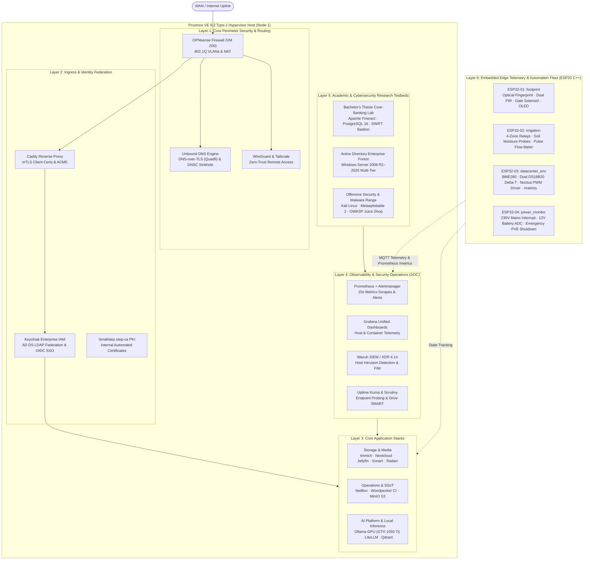

# Enterprise Homelab & Datacenter Wiki

[-10b981.svg?style=flat)](#)

---

Welcome to the **Enterprise Homelab & Datacenter Knowledge Base**. This wiki contains the complete architectural blueprints, configuration standards, operational runbooks, disaster recovery procedures, and edge microcontroller documentation for the `stefanutc1/infrastructure` platform.

```mermaid
flowchart TB
    Internet([" WAN / Internet Uplink"])

    subgraph PVE["Proxmox VE 9.2 Type-1 Hypervisor Host (Node 1)"]
        direction TB

        subgraph CORE["Layer 1: Core Perimeter Security & Routing"]
            OPN["OPNsense Firewall (VM 200)<br/>802.1Q VLANs & NAT"]
            DNS["Unbound DNS Engine<br/>DNS-over-TLS (Quad9) & DNSC Sinkhole"]
            VPN["WireGuard & Tailscale<br/>Zero-Trust Remote Access"]
        end

        subgraph INGRESS["Layer 2: Ingress & Identity Federation"]
            CADDY["Caddy Reverse Proxy<br/>mTLS Client Certs & ACME"]
            KEYCLOAK["Keycloak Enterprise IAM<br/>AD DS LDAP Federation & OIDC SSO"]
            STEPCA["Smallstep step-ca PKI<br/>Internal Automated Certificates"]
        end

        subgraph PLATFORM["Layer 3: Core Application Stacks"]
            STORAGE["Storage & Media<br/>Immich · Nextcloud · Jellyfin · Sonarr · Radarr"]
            OPS["Operations & SSoT<br/>NetBox · Woodpecker CI · MinIO S3"]
            AI["AI Platform & Local Inference<br/>Ollama GPU (GTX 1050 Ti) · LiteLLM · Qdrant"]
        end

        subgraph OBS["Layer 4: Observability & Security Operations (SOC)"]
            PROM["Prometheus + Alertmanager<br/>15s Metrics Scrapes & Alerts"]
            GRAF["Grafana Unified Dashboards<br/>Host & Container Telemetry"]
            WAZUH["Wazuh SIEM / XDR 4.14<br/>Host Intrusion Detection & FIM"]
            HEALTH["Uptime Kuma & Scrutiny<br/>Endpoint Probing & Drive SMART"]
        end

        subgraph RESEARCH["Layer 5: Academic & Cybersecurity Research Testbeds"]
            LICENTA["Bachelor's Thesis Core-Banking Lab<br/>Apache Fineract · PostgreSQL 16 · SWIFT Bastion"]
            AD["Active Directory Enterprise Forest<br/>Windows Server 2008 R2–2025 Multi-Tier"]
            CYBER["Offensive Security & Malware Range<br/>Kali Linux · Metasploitable 2 · OWASP Juice Shop"]
        end
    end

    subgraph EDGE["Layer 6: Embedded Edge Telemetry & Automation Fleet (ESP32 C++)"]
        EDGE1["ESP32-01: footprint<br/>Optical Fingerprint · Dual PIR · Gate Solenoid · OLED"]
        EDGE2["ESP32-02: irrigation<br/>4-Zone Relays · Soil Moisture Probes · Pulse Flow Meter"]
        EDGE3["ESP32-03: datacenter_env<br/>BME280 · Dual DS18B20 Delta-T · Noctua PWM Driver · /metrics"]
        EDGE4["ESP32-04: power_monitor<br/>230V Mains Interrupt · 12V Battery ADC · Emergency PVE Shutdown"]
    end

    Internet --> OPN
    OPN --> CADDY
    CADDY --> KEYCLOAK
    KEYCLOAK --> PLATFORM
    OPN --> DNS
    OPN --> VPN
    OBS --> PLATFORM
    RESEARCH --> OBS
    EDGE -.->|"MQTT Telemetry & Prometheus /metrics"| OBS
    EDGE -.->|"State Tracking"| PLATFORM
```

---

## Table of Contents

1. **[[Architecture & Networking|Architecture-and-Networking]]** — 802.1Q VLAN topology, subnet allocations, virtual bridges, and firewall policies.
2. **[[Services Catalog|Services-Catalog]]** — Complete inventory of 43 enterprise services, exposed ports, and volume layouts.
3. **[[Infrastructure as Code|Infrastructure-as-Code]]** — Terraform Proxmox VM modules and multi-cloud preventative zero-cost guardrails.
4. **[[Kubernetes & GitOps|Kubernetes-and-GitOps]]** — k3s edge worker cluster configuration, containerd runtime, and GitOps workflows.
5. **[[Monitoring & Alerting|Monitoring-and-Alerting]]** — Prometheus metrics scraping, node-level alert triggers, and Discord webhook routing.
6. **[[ESP32 Edge Systems|ESP32-Edge-Systems]]** — Embedded C++ firmware suite for access control, irrigation, rack thermals, and power failover.
7. **[[Runbooks & Disaster Recovery|Runbooks-and-Disaster-Recovery]]** — Operational runbooks, cold boot sequences, 3-2-1 backup strategy, and emergency shutdown procedures.
