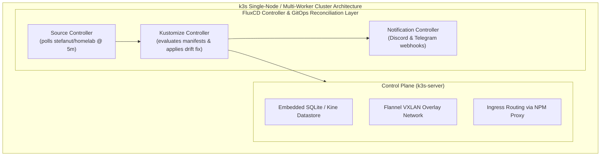

# Kubernetes & GitOps

## k3s Cluster Architecture

The Kubernetes layer runs a lightweight, production-tuned k3s cluster configured via Ansible in `kubernetes/ansible/`.



## Continuous Reconciliation with FluxCD

FluxCD monitors `kubernetes/gitops/` in the main repository:

```yaml
apiVersion: source.toolkit.fluxcd.io/v1
kind: GitRepository
metadata:
  name: homelab-repo
  namespace: flux-system
spec:
  interval: 5m0s
  url: https://github.com/stefanutc1/homelab
  ref:
    branch: main
---
apiVersion: kustomize.toolkit.fluxcd.io/v1
kind: Kustomization
metadata:
  name: cluster-workloads
  namespace: flux-system
spec:
  interval: 10m0s
  path: "./kubernetes/gitops/clusters/homelab"
  prune: true
  sourceRef:
    kind: GitRepository
    name: homelab-repo
```
