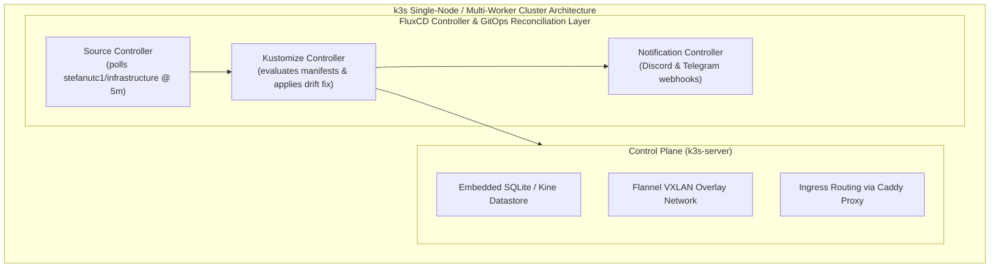

<div align="center">

# Kubernetes & GitOps

</div>

<div align="center">

## 1. k3s Edge Worker Architecture

</div>

The Kubernetes layer runs a lightweight, production-tuned k3s cluster configured via Ansible in `kubernetes/ansible/`. It offloads batch processing and stateless worker containers to Node 4 (`k8s_node_04`).


```mermaid
flowchart TB
    subgraph K8s["k3s Single-Node / Multi-Worker Cluster Architecture"]
        subgraph CP["Control Plane (k3s-server)"]
            DB["Embedded SQLite / Kine Datastore"]
            NET["Flannel VXLAN Overlay Network"]
            ING["Ingress Routing via Caddy Proxy"]
        end

        subgraph Flux["FluxCD Controller & GitOps Reconciliation Layer"]
            SRC["Source Controller<br/>(polls stefanutc1/infrastructure @ 5m)"]
            KUST["Kustomize Controller<br/>(evaluates manifests & applies drift fix)"]
            NOTIF["Notification Controller<br/>(Discord & Telegram webhooks)"]
        end
    end

    SRC --> KUST --> CP
    KUST --> NOTIF
```

---

<div align="center">

## 2. Continuous Reconciliation with GitOps

</div>

Continuous deployment monitors `kubernetes/gitops/` in the main infrastructure repository:

```yaml
apiVersion: source.toolkit.fluxcd.io/v1
kind: GitRepository
metadata:
  name: infrastructure-repo
  namespace: flux-system
spec:
  interval: 5m0s
  url: https://github.com/stefanutc1/infrastructure
  ref:
    branch: main
---
apiVersion: kustomize.toolkit.fluxcd.io/v1
kind: Kustomization
metadata:
  name: cluster-workloads
  namespace: flux-system
spec:
  interval: 10m0s
  path: "./kubernetes/gitops/clusters/homelab"
  prune: true
  sourceRef:
    kind: GitRepository
    name: infrastructure-repo
```
