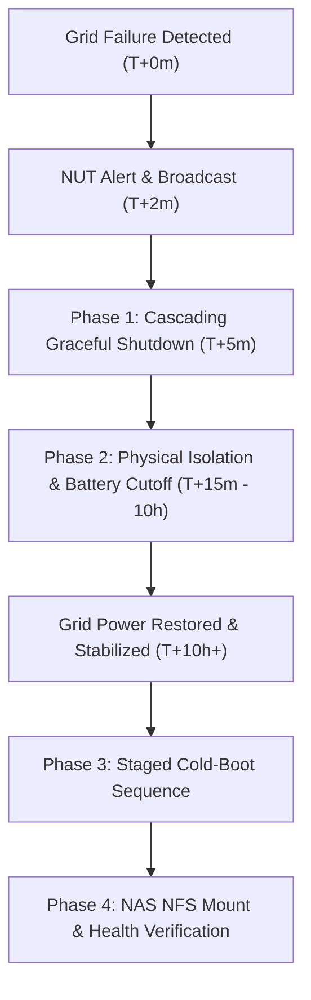

# Runbooks & Disaster Recovery

## 1.  Extended 10+ Hour Power Outage Standard Operating Procedure (SOP)

During prolonged blackouts ($> 10\text{ hours}$), battery-backed UPS reserves cannot sustain full compute workloads. To protect OpenMediaVault NAS NFS storage shares, database write journals, and delicate electronics from dirty dismounts or grid recovery power surges, follow this 4-phase protocol:



---

### Phase 1: Automated & Cascading Graceful Shutdown (0 – 15 min)
The automated script `/opt/homelab/scripts/emergency-shutdown.sh` executes the shutdown order:
1. **Tier 4 (Heavy Workloads & Media LXCs):** Plex (114), Jellyfin (115), Immich (116), Nextcloud (106), Torrent (117) — `pct shutdown 114..123`
2. **Tier 3 (Virtual Machines):** Windows Server (201), Ubuntu Server (202) — `qm shutdown 201 202`
3. **Tier 2 (Databases & Cache):** PostgreSQL (110), MariaDB (111), Redis (112) — `pct shutdown 103..113`
4. **Tier 1 (Auth & Ingress):** NPM (101), Authelia (102), Pi-hole (100) — `pct shutdown 101 102 100`
5. **Tier 0 (Core Gateway, NFS Unmount & Hypervisor):** OPNsense (200), `umount -a -t nfs,nfs4`, `sync`, Proxmox host `poweroff`.

---

### Phase 2: Long-Term 10+ Hour Outage Hardening & Physical Preservation
1. **Surge Suppressor Isolation:** Physically unplug the master surge protector from the wall outlet to shield equipment from high-voltage inrush spikes when the municipal electrical grid re-energizes.
2. **UPS Battery Protection:** Switch off the physical UPS power button to prevent deep-discharge cell degradation below safe threshold.
3. **Off-Grid Telemetry:** Out-of-band monitoring via battery-backed LTE/4G router or remote power status notification.

---

### Phase 3: Grid Restoration & Staged Cold-Boot Sequence
Execute the sequential restoration script `/opt/homelab/scripts/cold-boot-sequence.sh`:

1. **Grid Stabilization Window:** Wait 5–10 minutes after grid return for AC voltage stabilization (clean $230\text{V} \pm 5\%$ @ $50\text{Hz}$).
2. **Re-engage Surge Suppressor & UPS:** Verify input voltage and normal bypass charging state.
3. **Verify OpenMediaVault NAS (`192.168.1.5`):** Ensure NAS node is online and mount NFS shares (`mount -a -t nfs,nfs4`).
4. **Power On Hypervisor (`pve`):** Boot Proxmox VE hardware.
5. **Sequential Boot Hierarchy:**
   - `qm start 200` (OPNsense Gateway — wait 30s for WAN routing & DHCP).
   - `pct start 100` (Pi-hole DNS — enables internal name resolution).
   - `pct start 101 && pct start 102` (NPM Ingress & Authelia SSO).
   - `pct start 103..113` (Databases & Core Infrastructure).
   - `pct start 114..123 && qm start 201 202` (Applications, Media & Workload VMs).

---

### Phase 4: Post-Recovery Integrity & NFS Verification
```bash
# 1. Verify NFS Mounts & NAS Reachability
showmount -e 192.168.1.5
df -h -t nfs,nfs4

# 2. Verify Container Health
pct list
docker ps -a --filter "status=exited"

# 3. Database Checksums
sudo -u postgres psql -c "SELECT datname, pg_size_pretty(pg_database_size(datname)) FROM pg_database;"
```

---

## 2.  Automated Backup Hierarchy & 3-2-1 Strategy

- **Proxmox Backup Server (PBS):** Daily deduplicated snapshots of all 24 LXC containers and 3 KVM VMs with encrypted remote sync.
- **NAS NFS Backups:** Scheduled automated backups of application state and persistent volumes stored on OpenMediaVault NAS (`192.168.1.5`).
- **Offsite Cold Storage (AWS S3 / Restic):** Weekly encrypted backup of critical configs (`/etc/pve`, `/etc/network/interfaces`, `/opt/homelab`).
