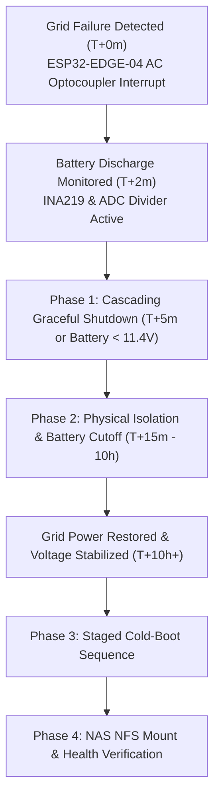

<div align="center">

# Runbooks & Disaster Recovery

</div>

<div align="center">

## 1. Extended Power Outage Standard Operating Procedure (SOP)

</div>

During prolonged blackouts, battery-backed UPS reserves cannot sustain full compute workloads indefinitely. To protect OpenMediaVault NAS ZFS storage pools, database write journals, and delicate electronics from dirty unmounts or grid recovery power surges, follow this 4-phase protocol:


```mermaid
graph TD
    A["Grid Failure Detected (T+0m)<br/>ESP32-EDGE-04 AC Optocoupler Interrupt"] --> B["Battery Discharge Monitored (T+2m)<br/>INA219 & ADC Divider Active"]
    B --> C["Phase 1: Cascading Graceful Shutdown (T+5m or Battery < 11.4V)"]
    C --> D["Phase 2: Physical Isolation & Battery Cutoff (T+15m - 10h)"]
    D --> E["Grid Power Restored & Voltage Stabilized (T+10h+)"]
    E --> F["Phase 3: Staged Cold-Boot Sequence"]
    F --> G["Phase 4: NAS NFS Mount & Health Verification"]
```

---

<div align="center">

### Phase 1: Automated & Cascading Graceful Shutdown (0 – 15 min)

</div>
Triggered manually or automatically via the `ESP32-EDGE-04` power monitor when battery drops below 11.4V:
```bash
# Executed via scripts/emergency-shutdown.sh
# 1. Tier 4 (Heavy Workloads & Media): Immich, Nextcloud, Jellyfin, qBittorrent
pct shutdown 105 100b 101b

# 2. Tier 3 (Virtual Machines): Windows Server, Kali, Research Lab VMs
qm shutdown 201 300 301 302 310 311 313

# 3. Tier 2 (Databases & Storage API): PostgreSQL, MinIO S3
pct shutdown 161

# 4. Tier 1 (Auth & Ingress): Caddy, Keycloak, Prometheus
pct shutdown 104 106

# 5. Tier 0 (Core Gateway, NFS Unmount & Hypervisor Host):
umount -a -t nfs,nfs4
qm shutdown 200
sync
poweroff
```

---

<div align="center">

### Phase 2: Long-Term Outage Hardening & Physical Preservation

</div>
1. **Surge Suppressor Isolation**: Physically unplug the master surge protector from the wall outlet to shield equipment from high-voltage inrush spikes when the electrical grid re-energizes.
2. **UPS Battery Protection**: Switch off the physical UPS power button to prevent deep-discharge cell degradation below safe thresholds.
3. **Off-Grid Telemetry**: Out-of-band monitoring via battery-backed LTE router or remote power status notification.

---

<div align="center">

### Phase 3: Grid Restoration & Staged Cold-Boot Sequence

</div>
Execute the sequential restoration script `scripts/cold-boot-sequence.sh`:

1. **Grid Stabilization Window**: Wait 5–10 minutes after grid return for AC voltage stabilization ($230\text{V} \pm 5\%$ @ $50\text{Hz}$).
2. **Re-engage Surge Suppressor & UPS**: Verify input voltage and normal bypass charging state.
3. **Verify OpenMediaVault NAS (`192.168.1.135`)**: Ensure NAS node is online and mount NFS shares (`mount -a -t nfs,nfs4`).
4. **Power On Hypervisor (`pve_primary_x64`)**: Boot Proxmox VE hardware.
5. **Sequential Boot Hierarchy**:
   - `qm start 200` (OPNsense Gateway — wait 30s for WAN routing & DHCP).
   - `pct start 100` (Home Assistant Core).
   - `pct start 101 && pct start 103` (Scrutiny & Uptime Kuma).
   - `pct start 104 && pct start 106` (Prometheus, Grafana & Wazuh SIEM).
   - `pct start 105 100b 101b 161` (Media Suite, Immich, Nextcloud, MinIO).

---

<div align="center">

### Phase 4: Post-Recovery Integrity & NFS Verification

</div>
```bash
# 1. Verify NFS Mounts & NAS Reachability
showmount -e 192.168.1.135
df -h -t nfs,nfs4

# 2. Verify Container Health
pct list
qm list

# 3. Run Automated Doctor
python3 scripts/audit_infrastructure.py
```

---

<div align="center">

## 2. Automated Backup Hierarchy & 3-2-1 Strategy

</div>

- **Proxmox Backup Server (PBS)**: Daily deduplicated, client-side encrypted snapshots of all LXC containers and KVM virtual machines.
- **NAS NFS Backups**: Scheduled automated backups of application state and persistent volumes stored on OpenMediaVault NAS (`192.168.1.135`).
- **Offsite Cold Storage**: Encrypted backup archives of critical hypervisor configs (`/etc/pve`, `/etc/network/interfaces`) synced to remote cloud object storage.
